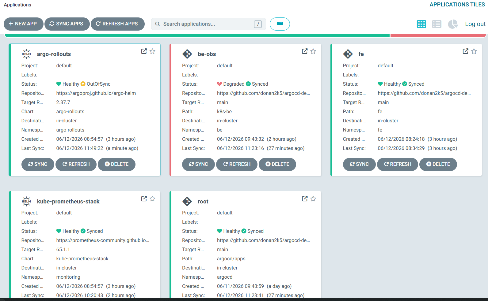
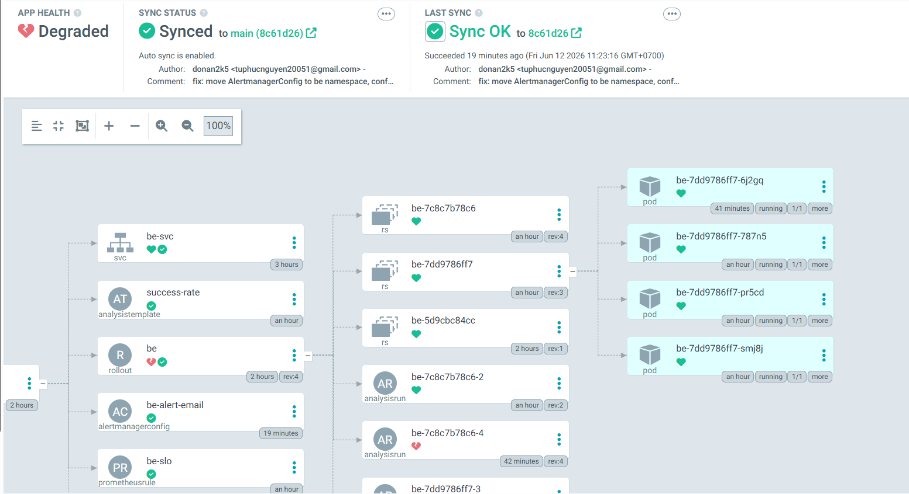
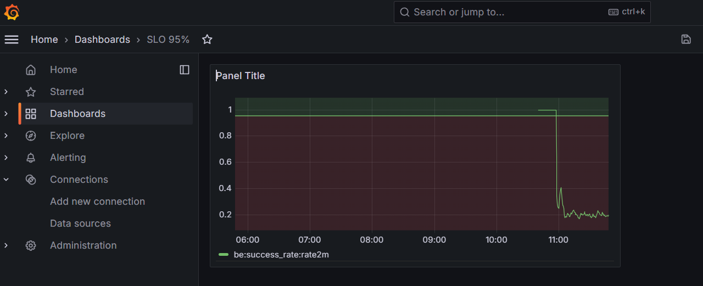
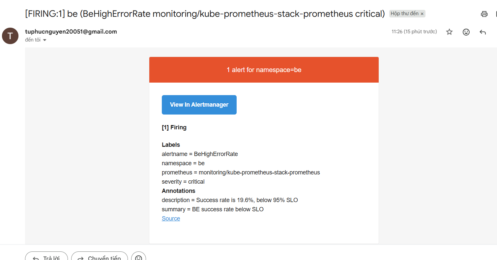

# ArgoCD GitOps Demo — Observability + Canary

Demo triển khai ứng dụng theo mô hình GitOps trên Minikube, kết hợp Canary deployment và Observability.

**Repo:** https://github.com/donan2k5/argocd-demo

---

## Challenge: Ship Smartly — Kết quả đạt được

### 1. Mọi thay đổi đều qua Git

Toàn bộ tài nguyên Kubernetes được quản lý bởi ArgoCD theo mô hình **App-of-Apps**:

- File `argocd/root.yaml` là root app, theo dõi thư mục `argocd/apps/` trên nhánh `main`
- Mỗi thay đổi push lên `main` → ArgoCD tự động sync vào cluster (poll ~3 phút)
- `selfHeal: true` — nếu ai sửa tay bằng `kubectl`, ArgoCD revert về trạng thái trong Git
- `prune: true` — xóa manifest khỏi Git thì resource cũng bị xóa khỏi cluster

ArgoCD quản lý 5 application, tất cả đều Synced từ Git:



Chi tiết từng resource trong app `be-obs` — Rollout, AnalysisRun, AlertmanagerConfig, PrometheusRule đều được sync từ Git:



---

### 2. SLO + Prometheus thu thập metrics từ BE

Backend FastAPI tự expose `/metrics` nhờ thư viện `prometheus-fastapi-instrumentator`.

**ServiceMonitor** (`k8s-be/servicemonitor.yaml`) đặt trong namespace `be` — báo cho Prometheus biết cần scrape `/metrics` của BE mỗi 15 giây.

**PrometheusRule** (`k8s-be/prometheus-rule.yaml`) định nghĩa:
- **Recording rule** — tính trước `be:success_rate:rate2m` (tỉ lệ request không lỗi trong 2 phút)
- **Alert rule** — kích hoạt `BeHighErrorRate` khi success rate < 95% trong 1 phút

```promql
sum(rate(http_requests_total{namespace="be",handler="/",status!~"5.."}[2m]))
/
sum(rate(http_requests_total{namespace="be",handler="/"}[2m]))
```

Grafana hiển thị SLO dashboard với ngưỡng 0.95 (đường đỏ). Khi inject `ERROR_RATE=0.8`, success rate rơi xuống ~20%:



---

### 3. Alert gửi email khi vi phạm SLO

**AlertmanagerConfig** (`k8s-be/alertmanager-config.yaml`) đặt trong namespace `be`:
- Match alert `BeHighErrorRate` có label `namespace=be`
- Gửi email qua Gmail SMTP đến `tuphucnguyen20051@gmail.com`
- Mật khẩu Gmail lưu trong Kubernetes Secret (không commit lên Git)

Khi success rate xuống dưới 95% hơn 1 phút, email được gửi tự động:



---

### 4. Canary tự động hủy khi metric dưới SLO

**Argo Rollouts** (`k8s-be/rollout.yaml`) triển khai theo chiến lược canary:

| Bước | Hành động |
|------|-----------|
| 1 | Chuyển 25% traffic sang version mới |
| 2 | Chờ 2 phút — AnalysisRun kiểm tra SLO mỗi 30 giây |
| 3 | Chuyển 50% traffic |
| 4 | Chờ 2 phút tiếp |
| 5 | Promote 100% nếu SLO đạt |

**AnalysisTemplate** (`k8s-be/analysis-template.yaml`) query Prometheus mỗi 30 giây. Nếu `be:success_rate:rate2m < 0.95` xảy ra **3 lần liên tiếp** → rollout tự động **Abort**, traffic quay về version stable.

### 5. Rollback bằng git revert (< 5 phút)

```bash
git revert HEAD --no-edit
git push origin main
# ArgoCD sync trong ~3 phút → Rollout cập nhật theo
```

---

## Kiến trúc namespace

```
namespace: argocd        → ArgoCD (quản lý toàn bộ)
namespace: monitoring    → Prometheus, Alertmanager, Grafana
namespace: argo-rollouts → Argo Rollouts controller
namespace: fe            → Frontend (Nginx + React)
namespace: be            → Backend (FastAPI) + toàn bộ config observability
                              ├── Rollout (canary strategy)
                              ├── ServiceMonitor (scrape /metrics)
                              ├── PrometheusRule (SLO + alert)
                              └── AlertmanagerConfig (email routing)
```

---

## Lưu ý bảo mật

File `k8s-be/email-secret.yaml` được thêm vào `.gitignore` — **không bao giờ commit credential lên Git**.

Tạo secret thủ công sau khi dựng cluster:

```bash
kubectl create secret generic alertmanager-email-secret \
  -n be \
  --from-literal=password="<gmail-app-password>"
```
